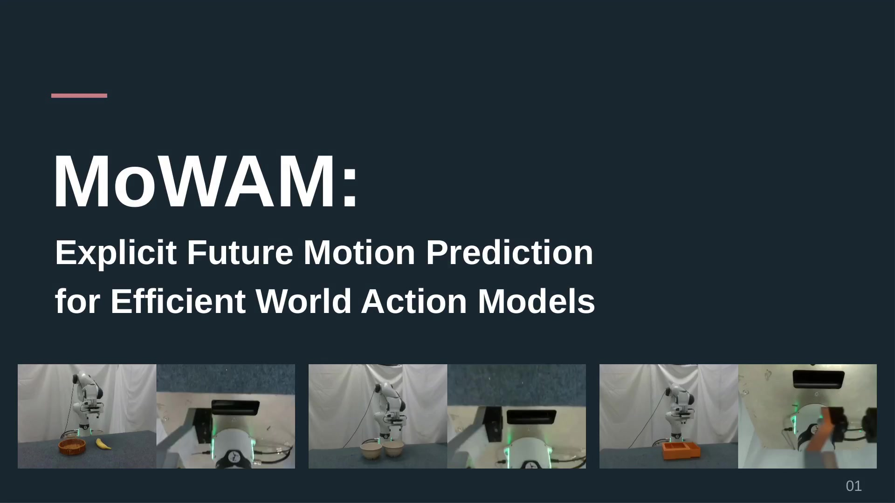
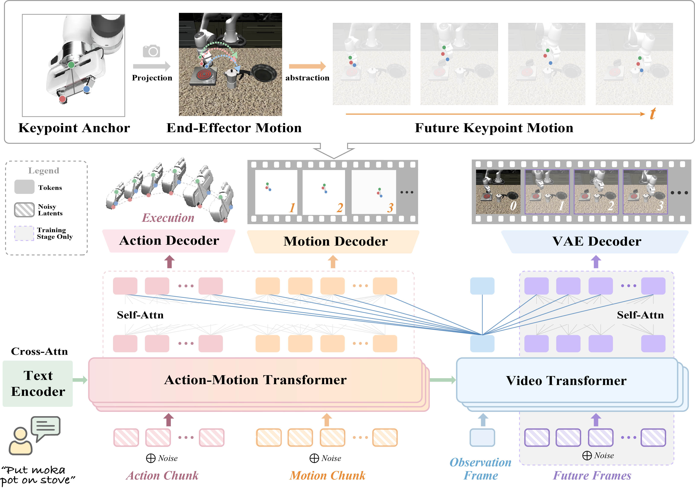
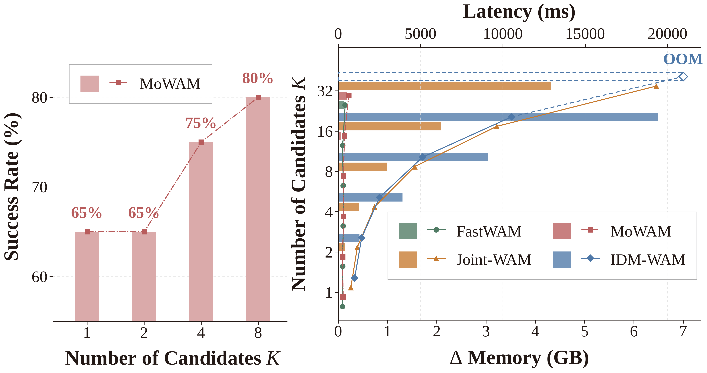

# MoWAM：Explicit Future Motion Prediction for Efficient World Action Models

[**Jiayu Wang**](https://github.com/emilia113)<sup>1</sup>,
[**Bin Zhu**](https://binzhubz.github.io/)<sup>2</sup>,
[**Yue Yu**](https://github.com/Yue-105)<sup>1</sup>,
[**Jingjing Chen**](https://jingjing1.github.io/)<sup>3*</sup>

¹ College of Computer Science and Artificial Intelligence, Fudan University  
² Singapore Management University  
³ Institute of Trustworthy Embodied AI, Fudan University  
<sup>*</sup> Corresponding author

[**Paper**](https://arxiv.org/abs/2609.20709) · [**Demonstrations**](#real-world-demonstrations) · [**Overview Video**](https://emilia113.github.io/MoWAM/#overview-title) · [**Citation**](#citation)

[](docs/assets/MoWAM-overview.mp4)

MoWAM predicts explicit future robot motion together with actions. It learns future visual dynamics during training and removes dense future video generation at inference.

## Abstract

World Action Models (WAMs) improve robot policy learning by incorporating future dynamics, yet generating future videos at inference introduces substantial computational overhead. We propose MoWAM, an efficient WAM that replaces future video generation with explicit future motion prediction. Structured end-effector motion provides a compact representation of how the robot is expected to evolve under the current scene and interaction constraints. A Mixture-of-Transformer architecture learns future visual dynamics during training while jointly predicting motion and action, allowing future video generation to be removed at inference. The compact motion representation also enables sampling multiple motion–action candidates and selecting among them with a motion-aware task-progress verifier. Experiments on LIBERO, LIBERO-Plus, and real-world manipulation tasks demonstrate strong in-domain performance, improved out-of-distribution robustness, and efficient inference-time candidate exploration.

## Method



MoWAM represents future end-effector motion in each camera view through the projected left fingertip, right fingertip, and palm. These keypoints define the gripper center, the span between fingertips, and the palm's offset from the center. Supervising both how these quantities change over time and their relative geometry lets the predicted motion describe where the gripper will move and how it will open or close. This motion is learned from execution trajectories rather than obtained by projecting predicted control commands.

During training, a Video Transformer learns future visual dynamics. Its representation of the current observation conditions an Action-Motion Transformer, which jointly predicts an action chunk and its future motion. At inference, MoWAM uses the observation representation without generating future video frames.

MoWAM can sample several motion–action pairs for the same observation. A verifier scores their predicted motions against the current image and instruction, then executes the action paired with the highest-scoring motion.

## Real-World Demonstrations

Successful MoWAM executions on a **Franka Research 3** robot. Two videos are available for each task.

### Pick Banana
<sub>Pick up the banana and place it in the basket.</sub>

https://github.com/user-attachments/assets/d85776e0-f62a-4224-acd6-d6b0559c2199

https://github.com/user-attachments/assets/2f5f5dfd-f9ef-4a04-a6e4-50d89c325395

### Stack Bowls
<sub>Pick up one bowl and stack it inside the other.</sub>


https://github.com/user-attachments/assets/154e7309-dcc7-4baf-94c7-7fa6e4e4f7fe


https://github.com/user-attachments/assets/13b5288d-0887-4360-acec-89902cb21f45

### Close Drawer
<sub>Close the open drawer.</sub>


https://github.com/user-attachments/assets/edc1ac95-40b8-44b1-b485-5140f08b744c


https://github.com/user-attachments/assets/653a2b5f-767b-4935-b7ad-5ad19f19ce99


## Experimental Results

Success rates are percentages; latency is milliseconds per action chunk. **Robo. P.T.** indicates robotic embodied pretraining (✓ = used; ✗ = not used).

### LIBERO

| Method | Robo. P.T. | Spatial | Object | Goal | Long | Average |
| --- | ---: | ---: | ---: | ---: | ---: | ---: |
| OpenVLA | ✓ | 84.7 | 88.4 | 79.2 | 53.7 | 76.5 |
| OpenVLA-OFT | ✓ | 97.2 | 97.8 | 96 | 96 | 96.75 |
| UniVLA | ✓ | 95.4 | 94.8 | 94.8 | 90.8 | 93.95 |
| π₀ | ✓ | 96.8 | 98.8 | 95.8 | 85.2 | 94.1 |
| π₀-FAST | ✓ | 97.8 | 97.8 | 88.2 | 61 | 86.2 |
| π₀.₅ | ✓ | 98.8 | 98.2 | 98 | 92.4 | 96.9 |
| LingBot-VA | ✓ | 98.5 | 99.6 | 97.2 | 98.5 | 98.5 |
| Motus | ✓ | 96.8 | 99.8 | 96.6 | 97.6 | 97.7 |
| LaWAM | ✓ | 99 | 96 | 97.2 | 93.4 | 96.4 |
| Fast-WAM | ✗ | 96.6 | 99.2 | 94.6 | 95.6 | 96.5 |
| IDM-WAM | ✗ | 98.6 | 99.4 | 98.4 | 96.4 | 98.2 |
| Joint-WAM | ✗ | 99 | 99.2 | 99 | 97.8 | 98.75 |
| **MoWAM** | **✗** | **98.8** | **99.8** | **99** | **97.8** | **98.9** |

The first six baselines are VLA-based methods; LingBot-VA through Joint-WAM are WAM-based methods. MoWAM achieves 98.9% average success without robotic embodied pretraining.

### LIBERO-Plus

**All methods are evaluated directly with checkpoints trained on LIBERO. No LIBERO-Plus data is used for training or fine-tuning, and no additional adaptation is performed before evaluation.**

| Method | Robo. P.T. | Objects | Camera | Initial | Light | Background | Sensor | Language | Average | Latency (ms) |
| --- | ---: | ---: | ---: | ---: | ---: | ---: | ---: | ---: | ---: | ---: |
| OpenVLA | ✓ | 53 | 2 | 15 | 24 | 54 | 32 | 44 | 32.00 | 128.71 |
| OpenVLA-OFT | ✓ | 73 | 65 | 27 | 94 | 89 | 70 | 87 | 72.14 | 103.3 |
| UniVLA | ✓ | 76 | 8 | 62 | 77 | 90 | 19 | 80 | 58.86 | 492.2 |
| π₀ | ✓ | 81 | 62 | 40 | 92 | 81 | 75 | 70 | 71.57 | 62.9 |
| π₀-FAST | ✓ | 73 | 62 | 26 | 72 | 76 | 70 | 78 | 65.29 | 274.22 |
| Motus | ✓ | 89 | 48 | 88 | 83 | 78 | 57 | 89 | 76.00 | 1621.9 |
| LaWAM | ✓ | 84 | 37 | 70 | 92 | 95 | 73 | 98 | 78.43 | 108.52 |
| Fast-WAM | ✗ | 82 | 42 | 74 | 85 | 63 | 72 | 75 | 70.43 | 260.1 |
| IDM-WAM | ✗ | 84 | 59 | 79 | 90 | 68 | 86 | 95 | 80.14 | 995.4 |
| Joint-WAM | ✗ | 85 | 51 | 91 | 95 | 67 | 78 | 97 | 80.57 | 766.3 |
| **MoWAM** | **✗** | **87** | **51** | **86** | **96** | **68** | **86** | **96** | **81.43** | **293.5** |

MoWAM reaches 81.43% average success, compared with 70.43% for Fast-WAM, 80.57% for Joint-WAM, and 80.14% for IDM-WAM. Per-shift results are shown in full; the benefit is not uniform across perturbation types.

### Real-World Evaluation

Twenty evaluation trials per task, with 100 collected demonstrations per task.

| Method | Robo. P.T. | Pick Banana | Stack Bowls | Close Drawer | Average | Latency (ms) |
| --- | ---: | ---: | ---: | ---: | ---: | ---: |
| Motus | ✓ | 65 | 65 | 85 | 71.67 | 1621.9 |
| Fast-WAM | ✗ | 30 | 85 | 20 | 45 | 260.1 |
| **MoWAM** | **✗** | **65** | **95** | **80** | **80** | **293.5** |

### Inference-Time Scaling: Success, Latency, and Memory

<p align="center">
  
</p>


| Number of candidates K | 1 | 2 | 4 | 8 |
| --- | ---: | ---: | ---: | ---: |
| Success rate (%) | 65 | 65 | 75 | 80 |

The figure reports action latency and additional GPU memory at K = 1–32; the table reports Pick Banana success.

### Ablation Studies

All ablation variants are trained on LIBERO-Long and evaluated directly on its corresponding LIBERO-Plus perturbations, without LIBERO-Plus training or fine-tuning. MoWAM reaches **76.00%** average success. Removing motion gives **65.71%**; removing the dynamics or structure loss gives **69.14%** or **73.71%**. Without Video DiT training, success is **33.14%**; without motion conditioning, it is **70.86%**.


Predicted motion estimates the resulting execution substantially more accurately in both ID and OOD settings. The OOD error is higher, while its advantage over action projection remains.

## Citation

If you find this work useful, please cite:

```bibtex
@article{wang2026mowam,
  title={MoWAM: Explicit Future Motion Prediction for Efficient World Action Models},
  author={Wang, Jiayu and Zhu, Bin and Yu, Yue and Chen, Jingjing},
  journal={arXiv preprint arXiv:2609.20709},
  year={2026}
}
```
